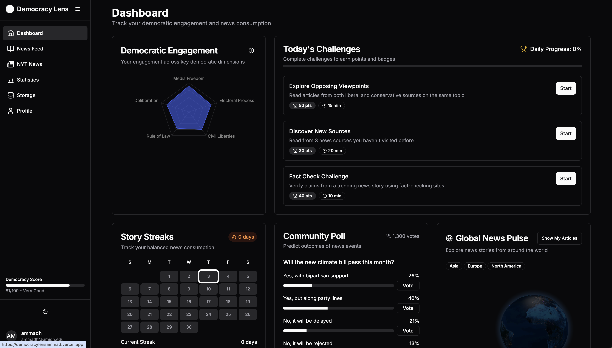

# 🗞️ Democracy News Lens

**Democracy News Lens** is a modern, interactive web application designed to **gamify balanced news consumption** and tie user engagement to core **democratic health indicators**. The goal is to promote more informed citizens by making the experience of reading diverse and credible news sources **fun, rewarding, and educational**.

---

## 🚀 Features

### 📊 Main Dashboard

#### 🕸️ Radar/Spider Chart
- Tracks user engagement across five democratic dimensions:
  - Media Freedom
  - Electoral Process
  - Civil Liberties
  - Rule of Law
  - Deliberation
- Interactive visuals with tooltips and clear explanations.

#### 🎯 Today’s Challenges
- Daily reading missions like:
  - Explore opposing viewpoints
  - Discover new sources
- Instant points and badge rewards upon completion.

#### 🔥 Story Streaks
- Visualize consecutive days of balanced or diverse news consumption.
- Engaging animations and incremental rewards to motivate users.

#### 📊 Interactive Polls & Predictions
- Participate in community polls predicting outcomes of news-related events.
- Real-time leaderboards tracking prediction accuracy and rankings.

#### 🕵️ Reading History
- Quick view of recent articles read.
- Tagged with sentiment and bias indicators.

---

### 📰 News Feed Page

#### 📚 Interactive News Articles
- Curated articles from diverse political spectrums.
- AI-powered summaries and interactive quizzes based on content.
- Powered by **NewsFeed API**.

#### 🧭 Political Spectrum Slider
- Adjust and filter articles by political leaning.
- View source reliability ratings quickly.

#### ⚖️ Balanced Reading Recommendations
- Smart prompts and challenges to encourage reading across perspectives.

---

### 🏆 Gamification Features

- **⏱️ Mini-Challenges**: Timed reading sprints, source diversity streaks.
- **🎖️ Achievement Badges**: Earn rewards for milestones and daily participation.

---

## 🎨 Visual Design

- **Color Scheme**: 
  - Blues and purples for democratic health indicators.
  - Neutral backgrounds for clarity and readability.

- **Design Philosophy**:
  - Clean, professional, and modern.
  - Responsive and accessible across all devices.

---

## 📡 News API Integration

This application integrates with the **NewsFeed API** to deliver real-time, politically diverse content.

---

## 🛠️ Setup Instructions

1. **Install Node Version 22.0.0**  
   Use [nvm](https://github.com/nvm-sh/nvm) to install and switch to Node.js v22:
   ```bash
   nvm use 22.0.0
   ```

2. **Install Dependencies**  
   Use the `--legacy-peer-deps` flag to resolve compatibility issues:
   ```bash
   npm install --legacy-peer-deps
   ```

3. **Configure Environment Variables**  
   Create a `.env` file in the root directory and fill in the following keys:
   ```
   NYT_API_KEY=your_key_here
   NEWS_API_KEY=your_key_here
   OPENAI_API_KEY=your_key_here
   NEXT_PUBLIC_SUPABASE_URL=your_url_here
   NEXT_PUBLIC_SUPABASE_ANON_KEY=your_key_here
   ```

4. **Run the App**  
   Start the development server:
   ```bash
   npm run dev
   ```

5. **View the App**  
   Open your browser and go to: [http://localhost:3000](http://localhost:3000)

---

## 🖼️ Example of Democracy Lens



---

## 👥 Contributors

<table>
  <tr>
    <td align="center">
      <a href="https://www.linkedin.com/in/ammadhassan1/">
        
        <br />
        <sub><b>Ammad Hassan</b></sub>
      </a>
      <br />
      <a href="https://x.com/ammadeth" target="_blank">🐦 Twitter</a>
    </td>
  </tr>
</table>

---

<p align="center">
  
  
  
</p>
